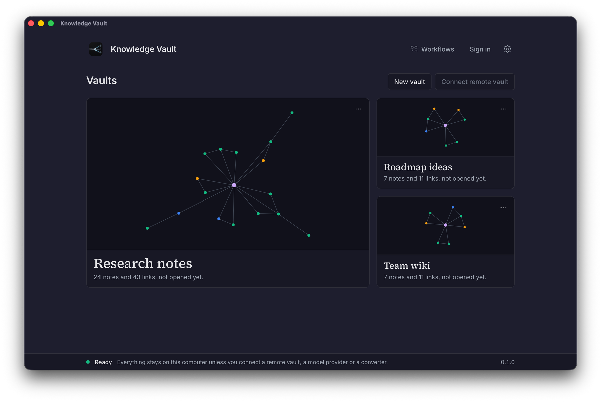

<p align="center">
  
</p>

<h1 align="center">Knowledge Vault</h1>

<p align="center">
  <strong>Turn what you read into a knowledge base you can search, explore and talk to — privately, on your own computer.</strong>
</p>

<p align="center">
  <a href="https://github.com/liberuum/knowledge-vault-app/releases/latest">Download</a> ·
  <a href="#how-it-works">How it works</a> ·
  <a href="#getting-started">Getting started</a> ·
  <a href="#privacy-and-your-data">Privacy</a>
</p>

<p align="center">
  
</p>

## What it is

Knowledge Vault is a desktop app for building a personal or team knowledge base from the documents you collect —
articles, reports, PDFs, meeting notes, web pages.

Instead of storing documents as they are, it breaks each one down into **atomic notes**: one clear claim per note,
written as a sentence you can agree or disagree with. Notes are **linked** to the notes they build on, support or
contradict, and gathered into **maps** by theme. Over time your vault becomes a connected web of ideas rather than
a folder of files — one you can browse as a graph, search by meaning, and ask questions in plain language.

Everything runs on your computer. Your vaults live in a database on your disk, and nothing leaves the machine unless
you choose to connect an AI model provider or a shared team vault.

## What you can do

- **Collect sources.** Drop in a PDF, a Word document, a web page or paste text. The original is kept alongside the
  readable text, so you can always go back to it.
- **Let the pipeline do the reading.** Queue a source and the app extracts its claims as notes, links them to what
  you already know, places them in the right maps and checks their quality — then waits for your review.
- **Explore the graph.** See how your notes connect, find clusters, spot gaps and contradictions.
- **Search by meaning.** Ask "how does sync handle conflicts?" and find the notes that answer it, even when they use
  different words.
- **Chat with your vault.** Ask questions and get answers built from your own notes, with the notes they came from.
- **Automate with workflows.** Each vault comes with its processing pipeline; the built-in Workflow Studio lets you
  see every run and build your own automations.
- **Work with a team.** Connect to a shared Knowledge Vault on a Powerhouse server and work in it with your own
  identity, alongside your local vaults.

## How it works

```
  Source              Notes                  Links                 Maps                 You
 ─────────►  extract  ─────────►  connect  ─────────►  organise  ─────────►  review  ─────────►
  a PDF, a page,     one claim per        "builds on",          notes gathered       approve what
  a document         note, in your        "contradicts",        by theme into        becomes part of
                     own vault            with the reason       a browsable tree     your knowledge
```

1. **You add a source** and choose *Queue for processing*.
2. **The pipeline picks it up** within a minute. Using the AI model you configured, it reads the source and writes
   one note per claim it finds, skipping filler and repetition.
3. **It connects each note** to related notes already in your vault, and writes down *why* they are related, so
   every link can be checked.
4. **It organises the notes into maps** — a topic map for each theme, gathered under a hub for the whole vault.
5. **It checks the result** and leaves the notes waiting for your review. You decide what becomes established
   knowledge.

You can watch every step as it happens: the processing label at the top of a vault opens its live run.

Under the hood the app runs a complete [Powerhouse](https://powerhouse.inc) engine on your machine — the same
software that powers shared vaults on a server — with a graph index and on-device semantic search. That is why a
local vault and a team vault look and work the same.

## Getting started

### 1. Download and install

Get the latest version from the **[Releases page](https://github.com/liberuum/knowledge-vault-app/releases/latest)**.

| System | Download | Notes |
|---|---|---|
| **Linux** | `Knowledge-Vault_<version>_Linux_x86-64.AppImage` or `…_Linux_x86-64.deb` | AppImage: make it executable and open it — nothing is installed. Debian/Ubuntu: `sudo apt install ./Knowledge-Vault_<version>_Linux_x86-64.deb`. Needs a 2022-or-newer distribution (Ubuntu 22.04, Debian 12, Fedora, Arch…). |
| **macOS** | `Knowledge-Vault_<version>_macOS_Apple-silicon.dmg` | macOS 13.5 or later on an Apple silicon Mac (M1 or newer); Intel Macs are not supported yet. Drag the app to Applications. The app is not notarised yet, so macOS blocks the first launch — see [Opening it on macOS](#opening-it-on-macos). |
| **Windows** | `Knowledge-Vault_<version>_Windows_x64-setup.exe` | Windows 10 or 11 (64-bit). The installer is not signed yet: if SmartScreen warns you, choose **More info › Run anyway**. The first start after installing or updating takes a little longer while the app unpacks its engine. |

The app brings everything it needs. You do not need to install anything else.

#### Opening it on macOS

The app is not notarised by Apple yet, so the first time you open it macOS stops it. You allow it once:

1. Open the app from Applications. macOS says it **could not verify "Knowledge Vault" is free of malware**.
   Choose **Done** — not *Move to Bin*, which deletes the app.
2. Open **System Settings › Privacy & Security** and scroll down to **Security**. Next to *"Knowledge Vault" was
   blocked to protect your Mac*, choose **Open Anyway**, and confirm with your password or Touch ID.
3. Choose **Open** in the dialog that follows. From then on the app opens normally, updates included.

If you prefer the Terminal, this does the same in one step:
`xattr -dr com.apple.quarantine "/Applications/Knowledge Vault.app"`

### 2. Follow the setup guide

The first time you open the app, a short setup guide walks you through what it needs. You can skip it and come
back to it any time from **Settings › About**.

1. **Choose your AI.** The pipeline and the chat need a language model. The guide offers four ways, and checks the
   one you pick with a real request before you go on:
   - **On this computer**: the app looks for a model already running here (Ollama, LM Studio, llama.cpp, vLLM,
     Jan and others) and offers the one it finds. Free, private, and nothing leaves your machine. If there is none,
     it tells you what size of model your graphics card runs well.
   - **Continue with ChatGPT**: use your ChatGPT Plus or Pro plan. You sign in once in the browser; no API key.
   - **OpenRouter**: one account for hundreds of models, pay as you go. Sign in with OpenRouter; no key to paste.
   - **API key**: OpenAI, Anthropic, Google Gemini, xAI, or any other OpenAI-compatible service.
2. **Name your first vault.**
3. **Add your first sources**: drop files, paste text, or start with the app's own guide, *How Knowledge Vault
   works*, whose notes explain how the app works.
4. **Watch your vault fill up.** Each source is read and turned into notes within a few minutes; the guide shows the
   progress and what you can do meanwhile.

Everything the guide sets up can be changed later in **Settings › Models**. The chat and the processing both use
that one model; your keys stay inside the app's engine and are never shown again.

### 3. Keep going with the checklist

The front page keeps a short **Getting started** list: add a source, read your first notes, ask your vault a
question, and, if you like, use your vault from Claude Code, Codex or Gemini CLI. Each step
ticks itself when you have done it, and the next one is always one click away.

**Tip:** sources with several related points give the richest results. A short source with only one or two claims
is kept, but needs company before it gets its own map.

## Privacy and your data

**What stays on your computer:** your vaults, notes, sources and their original files, the search index, your
settings and your sign-in. The app does not collect usage data and has no analytics.

**What leaves it, only when you choose:**

- the text sent to the **AI model provider** you configured (none, if you use a model on this computer), or to
  ChatGPT when you use your ChatGPT plan;
- your requests to a **shared team vault**, if you connect one;
- signing in with **[Renown](https://renown.id)**, the identity used for shared vaults.

**Where your data lives:**

| System | Folder |
|---|---|
| Linux | `~/.local/share/io.github.liberuum.knowledge-vault-app/` |
| macOS | `~/Library/Application Support/io.github.liberuum.knowledge-vault-app/` |
| Windows | `%APPDATA%\io.github.liberuum.knowledge-vault-app\` |

**Back up and export** from **Settings › Vaults**: make a backup of everything, restore it later, or export a single
vault as files. Uninstalling the app leaves your data in place; *Delete all local data* in Settings removes it.

## Working with a team

To use a shared Knowledge Vault hosted on a Powerhouse server, choose **Connect remote vault** and paste the server's
address: with or without `/graphql`, or a link to one of its vaults. The app lists the vaults that server lets you
read; pick one or several and they appear next to your local vaults. A vault on an open server needs no sign-in. For
a protected one, sign in with **Renown** first (Settings › Identity); you can open it as long as its administrator
has given your account access. You can also **protect** your local vaults so that every change is signed with your
identity.

## Use it with your own tools

The app's engine also serves your vaults to other tools on your computer, the Powerhouse command line and AI
agents that speak MCP, while the app is running. One command connects an agent; the **Getting started** list shows
it ready to copy, with this computer's address:

```bash
claude mcp add --transport http knowledge-vault http://127.0.0.1:4201/mcp     # Claude Code
codex mcp add knowledge-vault --url http://127.0.0.1:4201/mcp                 # Codex
gemini mcp add --transport http knowledge-vault http://127.0.0.1:4201/mcp     # Gemini CLI
```

**Settings › Diagnostics › Connect your tools** shows the addresses for the Powerhouse command line and GraphQL.

## Questions

**Does it work offline?** Yes, for everything except the AI steps when you use an online model provider. With a
local model it works entirely offline.

**What file types can it read?** Text, Markdown, web pages and PDFs with a text layer work out of the box. For
Word, PowerPoint, Excel, scanned PDFs and images the app installs its document converter on its own the first time it
starts, on Linux, Windows and Apple silicon Macs. **Settings › Conversion** shows its state and can remove it, or
point the app at a conversion server instead.

**How much does the AI cost?** It depends on your provider and model. Processing a typical article costs a fraction
of a cent with an efficient model; each run in Workflow Studio shows its cost.

**Something went wrong.** **Settings › Diagnostics** shows the engine's status and recent log lines, and can copy a
report with your private details removed.

## Contributing

Bug reports and ideas are welcome in the [issue tracker](https://github.com/liberuum/knowledge-vault-app/issues).
To build the app from source or work on it, see [CONTRIBUTING.md](CONTRIBUTING.md).

## License

Knowledge Vault is free software, released under the
[GNU Affero General Public License v3.0](LICENSE).
